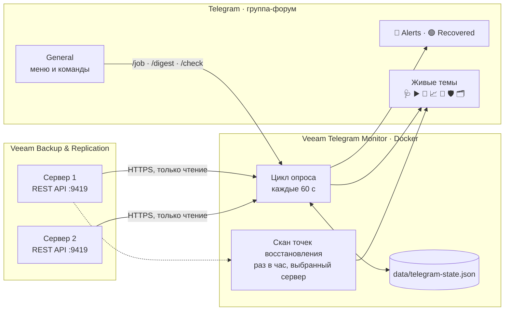

<div align="center">

&nbsp;
&nbsp;


# Veeam Telegram Monitor

**Бот, который следит за Veeam Backup & Replication и сам сообщает в Telegram,<br>что случилось с резервными копиями**

[](https://github.com/MuratFaizulla/veeam-monit/actions/workflows/test.yml)


[](LICENSE)

</div>

---

Бот опрашивает REST API Veeam и пишет в группу Telegram, когда задание упало, восстановилось или вот-вот упрётся в место на репозитории. В группе-форуме он держит **живые темы** — сообщения, которые сам обновляет на месте: что выполняется, что запланировано, у каких заданий нет свежих точек восстановления.

> Нажмите на раздел, чтобы раскрыть его.

<details>
<summary><h3>📨 Как выглядит оповещение</h3></summary>

Отрисовано кодом самого бота на тестовых данных:

```text
🔴 SQL_Nightly: ОШИБКА
Результат: ошибка
Было: успешно
Попытка: 1 из 4 · Veeam повторит ≈ сегодня в 03:54
Тип: бэкап ВМ
Последний запуск: сегодня в 03:02
Следующий запуск: завтра в 03:00

Не прошли: 1 из 3
🔴 sql01 — Failed to open VDDK disk [[DATASTORE01] sql01/sql01_1.vmdk] ( is read-only mode - [true] ) / Failed to open disk for read.

С предупреждением: 1 из 3
🟡 app01 — Unable to truncate SQL Server transaction logs.
```

Дальше бот следит за повторами сам: удался повтор — придёт «задание восстановлено», кончились попытки — одно сообщение «ОШИБКА, повторов больше не будет». Промежуточные неудачи молчат.

</details>

<details>
<summary><h3>✨ Возможности</h3></summary>

**🚨 Оповещения**
- ошибки и предупреждения заданий — с номером попытки, прогнозом повтора и списком ВМ, которые не прошли, с причиной от Veeam;
- восстановление задания после сбоя;
- потеря и возвращение связи с Veeam, проблемы со служебной учётной записью;
- нехватка места в репозитории;
- одинаковые оповещения не повторяются чаще заданного периода.

**📌 Живые темы** — по сообщению на тему, бот правит его на месте:

| Тема | Что в ней |
| --- | --- |
| 🩺 Monitor health | Связь с Veeam, авторизация, число заданий, все серверы и их IP |
| ▶️ Running now | Что выполняется: прогресс, сколько идёт, следующий запуск |
| 📅 Upcoming runs | Запуски, которые ещё предстоят сегодня |
| 📈 Performance | Скорость выполняющихся заданий |
| 💾 Repositories | Заполненность репозиториев |
| 🛡 Protection | Задания без свежих точек восстановления, пропуски по их ритму, серии неудач |
| 🗂 Restore points | Сколько точек у каждого задания и когда была последняя |
| 🧹 Orphaned backups | Цепочки бэкапов без задания *(выключена по умолчанию)* |

**⌨️ Команды и меню** — сводка, карточка задания, ручная проверка; меню «🖥 Серверы · 📊 Сводка · 🔄 Проверить · 🩺 Статус · 🤖 Помощь» под полем ввода.

**🖥 Несколько серверов Veeam** — оповещения со всех, живые темы и команды по выбранному.

**🧭 Маршрутизация** — темы по важности или по категории, свои правила в JSON-файле.

</details>

<details>
<summary><h3>🧭 Как это устроено</h3></summary>



Опрос идёт при старте и дальше по таймеру. Всё, что бот помнит между перезапусками, лежит в `data/telegram-state.json`: результаты заданий, запуски, которые Veeam ещё повторяет, чаты и темы, номера живых сообщений, периоды ожидания. После каждой записи рядом сохраняется копия `.bak`, и повреждённый файл восстанавливается из неё.

</details>

<details>
<summary><h3>🚀 Быстрый старт</h3></summary>

**Что нужно**
- Docker с Compose (или Node.js 22+).
- Доступ к REST API Veeam, обычно порт `9419`; версии API 1.1 и 1.2 бот различает сам.
- Учётная запись Veeam только для чтения — роль **Veeam Backup Viewer**.
- Бот от [@BotFather](https://t.me/BotFather) и **супергруппа с темами**, где у бота есть право **Manage topics**.

**1. Настройте `.env`** — скопируйте [.env.example](.env.example) и заполните:

```dotenv
VEEAM_SERVERS=https://veeam01.example.com:9419
VEEAM_MONITOR_USERNAME=svc-veeam-monitor
VEEAM_MONITOR_PASSWORD=...
TELEGRAM_BOT_TOKEN=...
TELEGRAM_CHAT_IDS=-1001234567890
TELEGRAM_ADMIN_KEY=...        # не короче 32 символов: openssl rand -hex 32
```

ID группы подскажет сам бот: запустите его с пустым `TELEGRAM_CHAT_IDS` и напишите в группе `/chatid`.

**2. Запустите**

```bash
docker compose up -d --build
docker compose logs -f
```

**3. Проверьте** — `GET http://localhost:3000/api/health` покажет, видны ли серверы Veeam. В течение минуты в группе появятся живые темы, а в General — меню.

**Без Docker** — `npm ci`, затем `npm run start:dev` для разработки или `npm run build && npm run start:prod`. На Windows можно через PM2: `npm run build`, `pm2 start ecosystem.config.cjs` (перед этим задайте `$env:PM2_HOME = Join-Path (Get-Location) '.pm2'`).

> [!CAUTION]
> Запускайте **один экземпляр** бота на токен. Два экземпляра отбирают друг у друга обновления Telegram (`409 Conflict`) и дублируют каждое оповещение.

</details>

<details>
<summary><h3>🐧 Эксплуатация на сервере</h3></summary>

Все команды — из папки проекта.

| Что нужно | Команда |
| --- | --- |
| Состояние (должно быть `Up … (healthy)`) | `docker compose ps` |
| Журнал в реальном времени | `docker compose logs -f --tail 100` |
| Перезапустить | `docker compose restart` |
| Остановить / запустить | `docker compose stop` / `docker compose start` |
| Память и CPU | `docker stats --no-stream veeam-telegram-monitor` |
| Жив ли сервис | `curl http://127.0.0.1:3000/api/health` |
| Выложить новую версию | `git pull && docker compose up -d --build` |
| Вернуться к версии | `git checkout v1.0.0 && docker compose up -d --build`; обратно на свежую — `git checkout main` |
| Применить правки `.env` | `docker compose up -d --force-recreate` (обычный `restart` их не видит) |

Контейнер сам поднимается после перезагрузки сервера. Журнал бота — `logs/backend.log`, журнал Docker ограничен тремя файлами по 10 МБ.

> [!WARNING]
> **Не удаляйте `data/`**: бот опубликует вторую копию всех живых тем и заново оповестит о старых сбоях. Для защиты от потери диска копируйте `data/telegram-state.json` и `.bak` на другой носитель.

Если у сервера нет доступа к Docker Hub, базовый образ `node:22-alpine` загружают вручную (`docker load`) — не заменяйте его потом через `docker pull`.

</details>

<details>
<summary><h3>💬 Telegram: темы, повторы, живые сообщения</h3></summary>

#### Куда приходят оповещения

По умолчанию бот работает через **long polling** — публичный адрес не нужен. Режим webhook включается через `TELEGRAM_WEBHOOK_URL` и `TELEGRAM_WEBHOOK_SECRET`.

| Событие | Тема (`TELEGRAM_ROUTING_MODE=single`) |
| --- | --- |
| Ошибка или предупреждение | 🚨 Alerts |
| Восстановление | 🟢 Recovered |
| Информационное событие | General |

Другие режимы: `severity` — по важности, `kind` — по категории, `job` — своя тема на задание. Адресные правила — в файле по образцу [telegram-routes.example.json](telegram-routes.example.json), путь в `TELEGRAM_ROUTES_FILE`; срабатывает первое совпадение.

#### Повторы Veeam

Veeam повторяет упавшее задание новой сессией, поэтому одна плохая ночь выглядит как три-четыре отказа. Бот считает их **одним запуском** и в строке «Попытка» пишет, что будет дальше:

| Текст | Когда |
| --- | --- |
| `1 из 4 · Veeam повторит ≈ сегодня в 03:54` | попытки остались, пауза ещё идёт |
| `2 из 4 · повтор уже идёт` | следующая попытка запущена |
| `4 из 4 · повторов больше не будет` | попытки кончились или пауза прошла без новой |

Заданиям, которые запускают вручную или выключили в Veeam, повтор не обещается: Veeam повторяет только то, что запустил сам. Пока следующая попытка не началась, бот не делает запросов к Veeam, а запуск, за которым он следит, переживает перезапуск бота.

#### Живые сообщения

- Telegram даёт боту править своё сообщение около 48 часов, поэтому живое сообщение заменяется новым через 36 часов.
- Удалённое сообщение или тему бот возвращает сам — не позже чем через `TELEGRAM_LIVE_REFRESH_MIN` минут.
- Разовый сбой Telegram (429, 5xx) не плодит дубли: старое сообщение остаётся и правится в следующем цикле.
- Автоудаление в группе держите **больше 36 часов** — и помните, что оно стирает и оповещения в 🚨 Alerts.

</details>

<details>
<summary><h3>⌨️ Команды и меню</h3></summary>

| Команда | Что делает |
| --- | --- |
| `/status` | Доступность Veeam, авторизация, число заданий. `/chatid` — то же с ID чата. |
| `/menu` | Вернуть меню под полем ввода. `/start` — то же. |
| `/servers` | Серверы Veeam; кнопкой выбирается тот, что показывают живые темы, `/digest` и `/job`. |
| `/check` | Опросить Veeam сейчас — не чаще раза в 30 секунд. |
| `/digest` | Сводка по всем заданиям и список проблемных. |
| `/job часть имени` | Карточка задания: результат, запуски, расписание, настройки, точки восстановления, какие ВМ не прошли. |
| `/topics` | Темы форума, известные боту. |
| `/clear` | Очистить General за последние 48 часов и поставить свежее меню. |
| `/help` | Справка. |

В форуме команды работают только в **General**. Кнопки меню — 🖥 Серверы, 📊 Сводка (`/digest`), 🔄 Проверить (`/check`), 🩺 Статус (`/status`), 🤖 Помощь (`/help`). Если меню удалили, бот вернёт его сам.

**Кто может говорить с ботом**

| Кто | Что получает |
| --- | --- |
| Группа из `TELEGRAM_CHAT_IDS` | Всё: оповещения, живые темы, команды |
| Личный чат участника такой группы | Команды и меню, без оповещений |
| Любая другая группа | Ничего — бот сам из неё выходит |
| Любой другой личный чат | Ничего, даже отказа |

</details>

<details>
<summary><h3>🖥 Несколько серверов Veeam</h3></summary>

Серверы перечисляются в `VEEAM_SERVERS` через запятую, учётная запись у всех одна.

- **Оповещения** приходят со всех серверов; если серверов больше одного, заголовок начинается с имени сервера: `BAAS · Files: ОШИБКА`.
- **Живые темы, `/digest` и `/job`** показывают выбранный сервер — «🖥 Серверы» или `/servers`. Выбор общий для группы и переживает перезапуск.
- В 🩺 перечислены все серверы: выбранный 🟢, остальные ⚪, упавший 🔴 с причиной.
- Скан точек восстановления читает только выбранный сервер; после переключения первое обновление может занять до минуты.
- Новый сервер первый цикл только запоминает: уже упавшие на нём задания оповещением не приходят.

</details>

<details>
<summary><h3>⚙️ Настройки</h3></summary>

Полный список с комментариями — в [.env.example](.env.example). Неверное значение останавливает запуск, и все ошибки называются сразу.

#### Veeam

| Переменная | По умолчанию | Назначение |
| --- | --- | --- |
| `VEEAM_SERVERS` | — | Серверы через запятую: `имя=адрес` или просто адрес. |
| `VEEAM_MONITOR_USERNAME`, `VEEAM_MONITOR_PASSWORD` | — | Служебная учётная запись, одна на все серверы. |
| `VEEAM_TLS_CERTS` | — | Закрепление сертификатов: `имя=путь_к_PEM`. При смене сертификата — ошибка `CERT_NOT_PINNED`, положите новый файл. |
| `VEEAM_INSECURE_TLS` | `false` | Не проверять сертификат незакреплённых серверов. Небезопасно. |
| `VEEAM_LEGACY_TLS` | — | Серверы, которым нужен старый TLS (SHA-1). |
| `VEEAM_API_VERSION` | `1.2-rev1` | Версия REST API; сервер постарше бот поймёт сам. |
| `VEEAM_TIMEOUT_MS` | `30000` | Сколько ждать ответа Veeam. |

#### Telegram

| Переменная | По умолчанию | Назначение |
| --- | --- | --- |
| `TELEGRAM_BOT_TOKEN` | — | Токен от BotFather. |
| `TELEGRAM_CHAT_IDS` | — | Группы для оповещений и живых тем. |
| `TELEGRAM_ADMIN_KEY` | — | Ключ HTTP-маршрутов, не короче 32 символов; пустой закрывает их. |
| `TELEGRAM_WEBHOOK_URL`, `TELEGRAM_WEBHOOK_SECRET` | — | Webhook вместо long polling; секрет не короче 32 символов. |
| `TELEGRAM_ROUTING_MODE` | `single` | `single`, `severity`, `kind` или `job`. |
| `TELEGRAM_ROUTES_FILE` | — | Файл адресных правил. |
| `TELEGRAM_CREATE_TOPICS` | `true` | Создавать недостающие темы. |
| `TELEGRAM_TIMEZONE` | пояс сервера | Часовой пояс сообщений; в Docker — `Asia/Qyzylorda`. |

#### Интервалы и пороги

| Переменная | По умолчанию | Назначение |
| --- | --- | --- |
| `TELEGRAM_MONITOR_INTERVAL_MS` | `60000` | Цикл опроса; `0` — без периодического опроса. |
| `TELEGRAM_PROTECTION_INTERVAL_MIN` | `60` | Скан точек восстановления. |
| `TELEGRAM_PROTECTION_STALE_DAYS` | `3` | В 🛡, если последней точке больше стольких дней… |
| `TELEGRAM_PROTECTION_OVERDUE_FACTOR` | `2.5` | …и больше стольких обычных интервалов задания. |
| `TELEGRAM_PROTECTION_FAILURE_STREAK` | `3` | Столько неудач подряд — в 🛡 даже со свежей точкой. |
| `TELEGRAM_REPOSITORY_FREE_PERCENT` | `10` | Порог свободного места; ниже половины — критично; `0` — не следить. |
| `TELEGRAM_JOB_COOLDOWN_MIN` | `15` | Не повторять оповещение о задании чаще. |
| `TELEGRAM_AUTH_COOLDOWN_MIN`, `TELEGRAM_REPOSITORY_COOLDOWN_MIN` | `60`, `720` | То же для учётной записи и репозиториев. |
| `TELEGRAM_DIGEST_HOUR` | `-1` | Час ежедневной сводки; `-1` — не присылать. |
| `TELEGRAM_LIVE_REFRESH_MIN` | `5` | Живые темы и меню проверяются не реже. |

#### Прочее

| Переменная | По умолчанию | Назначение |
| --- | --- | --- |
| `TELEGRAM_LIVE`, `TELEGRAM_LIVE_ORPHANS` | `true`, `false` | Живые темы и тема 🧹. |
| `TELEGRAM_TOPIC_*` | см. `.env.example` | Названия тем. |
| `HOST_BIND`, `HOST_PORT` | `127.0.0.1`, `3000` | Где Compose публикует порт. |
| `API_DOCS` | `false` | Swagger на `/api/docs`. |
| `TELEGRAM_STATE_FILE`, `LOG_FILE` | `data/…`, `logs/…` | Файл состояния и журнал. |

</details>

<details>
<summary><h3>🔌 HTTP API и Swagger</h3></summary>

| Маршрут | Доступ | Назначение |
| --- | --- | --- |
| `GET /api/health` | открыт | Видны ли серверы Veeam — без имён и адресов. |
| `GET /api/telegram/status` | ключ | Состояние интеграции, очереди и монитора. |
| `GET /api/telegram/chats` | ключ | Известные чаты и темы. |
| `GET /api/telegram/routes` | ключ | Действующие правила маршрутизации. |
| `POST /api/telegram/routes/reload` | ключ | Перечитать файл правил. |
| `POST /api/telegram/check` | ключ | Запустить цикл проверки. |
| `POST /api/telegram/test` | ключ | Тестовое событие через весь путь доставки. |
| `POST /api/telegram/notify` | ключ | Отправить объявление. |
| `POST /api/telegram/webhook` | секрет webhook | Обновления от Telegram. |

```bash
curl -H "X-Telegram-Admin-Key: $TELEGRAM_ADMIN_KEY" http://127.0.0.1:3000/api/telegram/status
```

**Swagger** выключен по умолчанию. Включите `API_DOCS=true`, выполните `docker compose up -d --force-recreate` и откройте туннель со своего компьютера — порт доступен только на сервере:

```bash
ssh -L 3000:127.0.0.1:3000 <пользователь>@<сервер>
```

Затем **http://localhost:3000/api/docs** в браузере и **Authorize** с ключом администратора. Закончив, верните `API_DOCS=false`.

</details>

<details>
<summary><h3>🔒 Безопасность</h3></summary>

- **Только чтение** — боту хватает роли Veeam Backup Viewer.
- **Чужим — ничего** — бот отвечает только своим группам и их участникам.
- **Ключи** — не короче 32 символов, сравниваются за постоянное время; пустой ключ закрывает маршруты.
- **TLS** — сертификаты Veeam закреплены по отпечатку, пароль уходит только на проверенный сервер.
- **Секреты** — пароль и токен не пишутся ни в журнал, ни в чат; `.env` не попадает ни в git, ни в образ.
- **Контейнер** — не root, без Linux capabilities, файловая система только для чтения, 512 МБ памяти.
- **Порт** — только на `127.0.0.1`, пока явно не задан `HOST_BIND=0.0.0.0`.

Что делать, если утёк секрет, — в [SECURITY.md](SECURITY.md).

</details>

<details>
<summary><h3>🛠 Разработка</h3></summary>

```bash
npm run lint   # проверка типов TypeScript
npm test       # сборка и все тесты (node:test)
```

Тесты запускаются в GitHub Actions на каждый push в `main` и pull request, Dependabot раз в неделю предлагает обновления библиотек.

Один Nest-модуль на предмет, одна папка на модуль; импорты идут только вниз по слоям — это проверяет `test/architecture.test.cjs`:

```
updates   команды, кнопки, webhook, HTTP-эндпоинты
monitor   цикл опроса и оповещения
live      живые темы
estate    точки восстановления, карточка задания, сводка, запуски
veeam     HTTP-клиент, токен, чтение Veeam
telegram  доставка: чаты, темы, маршрутизация, файл состояния
config    настройки
```

| Документ | Что в нём |
| --- | --- |
| [CHANGELOG.md](CHANGELOG.md) | Что изменилось в каждой версии |
| [SECURITY.md](SECURITY.md) | Как сообщить об уязвимости и что делать, если утёк секрет |
| [CONTEXT.md](CONTEXT.md) | Словарь предметной области: Run, Attempt, Evidence и другие термины кода |
| [docs/adr/](docs/adr/) | Архитектурные решения |
| [docs/veeam-openapi.json](docs/veeam-openapi.json) | Спецификация REST API самого Veeam |

</details>

---

<div align="center">
<sub>
© 2026 Мурат Файзулла · закрытая лицензия, все права защищены — <a href="LICENSE">LICENSE</a><br>
Veeam и Veeam Backup & Replication — товарные знаки Veeam Software; проект с ней не связан.<br>
Иконки — <a href="https://simpleicons.org">Simple Icons</a> (CC0).
</sub>
</div>
