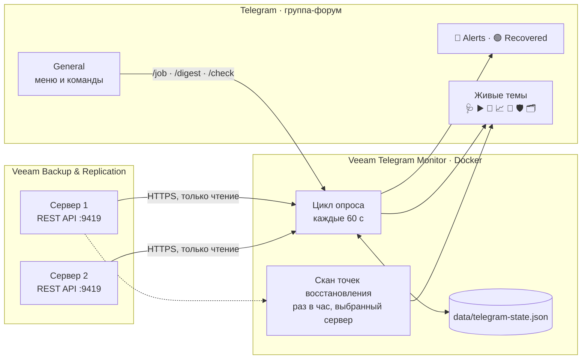

<div align="center">


&nbsp;&nbsp;&nbsp;<b>➜</b>&nbsp;&nbsp;&nbsp;


# Veeam Telegram Monitor

**Бот, который следит за Veeam Backup & Replication и сам сообщает в Telegram,<br>что случилось с резервными копиями**

[](https://github.com/MuratFaizulla/veeam-monit/actions/workflows/test.yml)


[Возможности](#-возможности) ·
[Быстрый старт](#-быстрый-старт) ·
[Эксплуатация](#-эксплуатация-на-сервере) ·
[Команды](#%EF%B8%8F-команды-бота) ·
[Настройки](#%EF%B8%8F-настройки) ·
[HTTP API](#-http-api) ·
[Безопасность](#-безопасность) ·
[Разработка](#-разработка)

</div>

---

Сервис на NestJS опрашивает REST API Veeam и пишет в группу Telegram, когда задание упало, восстановилось или вот-вот упрётся в место на репозитории. В группе-форуме он ещё и держит **живые темы**: сообщения, которые сам обновляет на месте, — что выполняется сейчас, что запланировано, у каких заданий нет свежих точек восстановления. Веб-панели нет: всё видно в Telegram.

Так выглядит оповещение. Бот отрисовал его своим же кодом на тестовых данных:

```text
🔴 SQL_Nightly: ОШИБКА
Результат: ошибка
Было: успешно
Попытка: 1 из 4 · Veeam повторит ≈ сегодня в 03:54
Тип: бэкап ВМ
Последний запуск: сегодня в 03:02
Следующий запуск: завтра в 03:00

Не прошли: 1 из 3
🔴 sql01 — Failed to open VDDK disk [[DATASTORE01] sql01/sql01_1.vmdk] ( is read-only mode - [true] ) / Failed to open disk for read.

С предупреждением: 1 из 3
🟡 app01 — Unable to truncate SQL Server transaction logs.
```

Дальше бот следит за повторами сам: удался повтор — придёт «задание восстановлено», кончились попытки — одно сообщение «ОШИБКА, повторов больше не будет». Промежуточные неудачи молчат.

## ✨ Возможности

**🚨 Оповещения**
- новые ошибки и предупреждения заданий — с номером попытки, прогнозом повтора и списком ВМ, которые не прошли, с причиной от Veeam;
- восстановление задания после сбоя;
- потеря и возвращение связи с Veeam, проблемы со служебной учётной записью;
- нехватка места в репозитории;
- повторяющиеся оповещения сдерживаются периодами ожидания.

**📌 Живые темы** — по сообщению на тему, бот правит его на месте:

| Тема | Что в ней |
| --- | --- |
| 🩺 Monitor health | Связь с Veeam, авторизация, число заданий под наблюдением, все серверы и их IP |
| ▶️ Running now | Что выполняется: прогресс, сколько идёт, следующий запуск |
| 📅 Upcoming runs | Запуски, которые ещё предстоят сегодня |
| 📈 Performance | Скорость выполняющихся заданий |
| 💾 Repositories | Заполненность репозиториев |
| 🛡 Protection | Задания без свежих точек восстановления, пропуски по их обычному ритму, серии неудач |
| 🗂 Restore points | Сколько точек у каждого задания и когда была последняя |
| 🧹 Orphaned backups | Цепочки бэкапов, у которых больше нет задания *(выключена по умолчанию)* |

**⌨️ Команды и меню.** Сводка, карточка любого задания, ручной запуск проверки. Под полем ввода — постоянное меню «🖥 Серверы · 📊 Сводка · 🔄 Проверить · 🩺 Статус · 🤖 Помощь», под ответами — кнопки перехода к заданиям.

**🖥 Несколько серверов Veeam в одном боте.** Оповещения приходят со всех, а живые темы, `/digest` и `/job` показывают сервер, выбранный в меню.

**🧭 Маршрутизация.** Темы по важности или по категории, фильтр по важности, свои правила в JSON-файле.

## 🧭 Как это устроено



Опрос идёт при старте и дальше по таймеру. Всё, что бот должен помнить между перезапусками, лежит в `data/telegram-state.json`:
- последние результаты заданий и запуски, которые Veeam ещё повторяет;
- известные чаты и темы;
- номера живых сообщений;
- периоды ожидания.

После каждой записи рядом сохраняется копия `telegram-state.json.bak`, и если основной файл повреждён, состояние восстанавливается из неё.

## 📋 Требования

- **Docker с Compose** — или Node.js 22+ и npm.
- Доступ к REST API Veeam Backup & Replication, обычно порт `9419`. Поддерживаются REST API 1.1 и 1.2: версию бот подбирает для каждого сервера сам.
- Отдельная учётная запись Veeam только для чтения; рекомендуемая роль — **Veeam Backup Viewer**.
- Telegram-бот, созданный через [@BotFather](https://t.me/BotFather), и группа, куда он добавлен.

> [!TIP]
> Для живых тем нужна **супергруппа с включёнными темами (форум)**. Выдайте боту право **Manage topics** — тогда он сам создаст недостающие темы. Без этого права сообщения, которым негде жить, попадут в General.

## 🚀 Быстрый старт

**1. Настройте `.env`.** Скопируйте [.env.example](.env.example) в `.env` и заполните как минимум:

```dotenv
VEEAM_SERVERS=https://veeam01.example.com:9419
VEEAM_MONITOR_USERNAME=svc-veeam-monitor
VEEAM_MONITOR_PASSWORD=...
TELEGRAM_BOT_TOKEN=...
TELEGRAM_CHAT_IDS=-1001234567890
TELEGRAM_ADMIN_KEY=...        # не короче 32 символов: openssl rand -hex 32
```

> [!NOTE]
> ID группы проще всего узнать у самого бота: запустите его с пустым `TELEGRAM_CHAT_IDS` и напишите в группе `/chatid`. Несколько групп перечисляются через запятую.

**2. Запустите.**

```bash
docker compose up -d --build
docker compose logs -f
```

**3. Проверьте.** `GET http://localhost:3000/api/health` отвечает, видны ли серверы Veeam. В течение минуты в группе появятся живые темы, а в General — меню.

<details>
<summary><b>Без Docker: Node.js</b></summary>

```bash
npm ci
npm run start:dev          # разработка, с перезапуском при правках
npm run build && npm run start:prod   # собранная версия
```

</details>

<details>
<summary><b>Без Docker: PM2 на Windows</b></summary>

PM2 запускает собранный сервис по [ecosystem.config.cjs](ecosystem.config.cjs). Команды выполняйте из корня проекта; `.env` приложение прочитает оттуда же. Сначала задайте рабочую папку PM2 для текущего окна PowerShell и используйте её же для всех последующих команд:

```powershell
$env:PM2_HOME = Join-Path (Get-Location) '.pm2'
```

```bash
npm ci
npm run build
pm2 start ecosystem.config.cjs
pm2 status
pm2 logs veeam-telegram-monitor
```

После обновления кода: `npm run build`, затем `pm2 restart veeam-telegram-monitor --update-env`. Остановка — `pm2 stop veeam-telegram-monitor`. Автозапуск после перезагрузки Windows настраивается отдельно.

</details>

> [!CAUTION]
> Запускайте **только один экземпляр** бота с одним токеном. Два экземпляра (например, Docker и PM2) отбирают друг у друга обновления Telegram (`409 Conflict`) и дублируют каждое оповещение.

## 🐧 Эксплуатация на сервере

Все команды — из папки проекта на сервере.

| Что нужно | Команда |
| --- | --- |
| Состояние контейнера (должно быть `Up … (healthy)`) | `docker compose ps` |
| Журнал в реальном времени | `docker compose logs -f --tail 100` |
| Перезапустить | `docker compose restart` |
| Остановить / запустить | `docker compose stop` / `docker compose start` |
| Сколько памяти и CPU занимает | `docker stats --no-stream veeam-telegram-monitor` |
| Жив ли сервис | `curl http://127.0.0.1:3000/api/health` |

**Выложить новую версию:**

```bash
git pull
docker compose up -d --build
```

**Поменять настройки:** отредактируйте `.env` и выполните `docker compose up -d --force-recreate`. Обычный `restart` новый `.env` не перечитывает.

Контейнер поднимается сам после перезагрузки сервера (`restart: unless-stopped`), журнал Docker ограничен тремя файлами по 10 МБ, собственный журнал бота пишется в `logs/backend.log`.

> [!WARNING]
> **Не удаляйте `data/`.** Без неё бот опубликует вторую копию всех живых тем и заново оповестит о старых сбоях. Для защиты от потери диска копируйте `data/telegram-state.json` и `.bak` на другой носитель.

> [!NOTE]
> Если у сервера нет доступа к Docker Hub, базовый образ `node:22-alpine` загружают вручную (`docker load`). Не заменяйте его потом через `docker pull`.

## 💬 Подключение к Telegram

По умолчанию бот работает через **long polling** — публичный адрес не нужен. Если задан `TELEGRAM_WEBHOOK_URL`, бот регистрирует webhook `<TELEGRAM_WEBHOOK_URL>/api/telegram/webhook`: нужен публичный HTTPS-адрес и `TELEGRAM_WEBHOOK_SECRET`, который Telegram присылает в заголовке `X-Telegram-Bot-Api-Secret-Token`.

Куда попадают оповещения при режиме по умолчанию `TELEGRAM_ROUTING_MODE=single`:

| Событие | Тема |
| --- | --- |
| Ошибка или предупреждение | 🚨 Alerts |
| Восстановление | 🟢 Recovered |
| Информационное событие | General |

Другие режимы: `severity` — тема по важности, `kind` — по категории, `job` — своя тема на каждое задание. Живые темы живут отдельно при любом режиме. При `TELEGRAM_CREATE_TOPICS=false` бот пользуется только известными темами, остальное пишет в General.

Для адресных правил скопируйте [telegram-routes.example.json](telegram-routes.example.json), укажите путь в `TELEGRAM_ROUTES_FILE` и перечитайте его через `POST /api/telegram/routes/reload`. Правила проверяются сверху вниз, срабатывает первое совпадение.

### 🔁 Повторы Veeam

Veeam повторяет упавшее задание новой сессией, так что одна плохая ночь выглядит как три-четыре отказа. Бот считает их **одним запуском**: две сессии — один запуск, если новая началась в пределах окна повтора после окончания предыдущей (пауза `awaitMinutes` задания плюс запас на длительность самой попытки).

В строке **«Попытка»** сказано, что будет дальше:

| Текст | Когда |
| --- | --- |
| `1 из 4 · Veeam повторит ≈ сегодня в 03:54` | попытки остались, пауза ещё не прошла |
| `2 из 4 · повтор уже идёт` | следующая попытка уже запущена |
| `4 из 4 · повторов больше не будет` | попытки кончились или пауза прошла без новой |

Veeam повторяет только те запуски, которые начал сам, поэтому заданиям, которые запускают вручную или выключили в Veeam, бот повтор не обещает и не ждёт.

<details>
<summary><b>Подробнее: как бот следит за повтором</b></summary>

- Об отказе бот сообщает после первой попытки, дальше следит за запуском. Промежуточные неудачные повторы молчат.
- Пока следующая попытка не началась, слежение не делает запросов к Veeam.
- Пока идёт повтор, Veeam сообщает результат `none`. Бот **не** записывает его поверх известного: `none` значит «сейчас не знаю». Иначе восстановление не пришло бы никогда — к моменту успеха предыдущим результатом значился бы `none`, а не ошибка.
- Запуск, за которым идёт слежение, хранится в `data/telegram-state.json`, поэтому перезапуск бота между попытками последнее сообщение не теряет.
- Список ВМ под оповещением берётся из задач сессии (REST API 1.2) или из её лога (1.1). Показывается до пяти ВМ каждого вида, остальные считаются. Служебные строки Veeam — параметры подключения с логином, трассировка агента — вырезаются.

</details>

### 📌 Живые сообщения

<details>
<summary><b>Лимит Telegram в 48 часов и автоудаление</b></summary>

Telegram разрешает боту править и удалять своё сообщение примерно двое суток **с момента отправки**, сколько бы раз его ни правили. Поэтому живое сообщение заменяется новым через 36 часов, пока старое ещё можно удалить. Иначе однажды правка не пройдёт, удаление тоже, и в теме останутся два сообщения: застывшее и актуальное. Если такие застывшие сообщения уже есть, удалите их вручную — бот их не может.

Если в группе включено **автоудаление**, держите его **больше 36 часов**. При меньшем сроке живое сообщение исчезнет раньше замены; бот заметит пропажу при ближайшей проверке (не позже чем через `TELEGRAM_LIVE_REFRESH_MIN` минут) и опубликует новое. Помните: автоудаление одинаково стирает и живые сообщения, и **оповещения** — тема 🚨 Alerts превратится в скользящее окно.

</details>

<details>
<summary><b>Если тему удалили или Telegram дал сбой</b></summary>

Удалённую тему бот создаёт заново под тем же именем и кладёт в неё текущее живое сообщение: в следующем цикле, если содержимое меняется, или не позже чем через `TELEGRAM_LIVE_REFRESH_MIN` минут (по умолчанию 5). Тема 🚨 Alerts вернётся со следующим оповещением. История удалённой темы стирается вместе с ней.

Разовый сбой Telegram — 429, 5xx, оборванное соединение — не повод публиковать новое сообщение: старое остаётся, в следующем цикле бот правит его снова, а в журнал пишет `was not refreshed, kept for the next cycle`.

</details>

## ⌨️ Команды бота

| Команда | Что делает |
| --- | --- |
| `/status` | Доступность Veeam, авторизация, число заданий, время последней проверки. `/chatid` — то же вместе с ID чата. |
| `/menu` | Показывает меню под полем ввода, если оно пропало. `/start` — то же самое. |
| `/servers` | Серверы Veeam и их состояние; кнопкой выбирается сервер для живых тем, `/digest` и `/job`. |
| `/check` | Опросить Veeam сейчас, если цикл уже не идёт. Повторный вызов — не чаще раза в 30 секунд. |
| `/digest` | Сводка по всем заданиям и список проблемных. Выключенные в Veeam задания считаются отдельной строкой. |
| `/job часть имени` | Карточка задания: последний результат, запуски, расписание, настройки, точки восстановления, какие ВМ не прошли. |
| `/topics` | Темы форума, известные боту. |
| `/clear` | Очищает General: удаляет всё сказанное там за 48 часов и ставит свежее меню. Темы не трогает. |
| `/help` | Справка. |

В группе-форуме команды работают только в **General**; в остальных темах бот их игнорирует. `/digest` и `/job` читают Veeam в момент запроса.

### Меню под полем ввода

| Кнопка | Что делает |
| --- | --- |
| 🖥 Серверы | Список серверов; клавиатура сменяется кнопками серверов и «⬅️ На главную». Нажатие выбирает сервер. |
| 📊 Сводка | То же, что `/digest` |
| 🔄 Проверить | То же, что `/check` |
| 🩺 Статус | То же, что `/status` |
| 🤖 Помощь | То же, что `/help` |

Меню живёт в сообщении «Меню Veeam Monitor» в General. Бот проверяет его каждые `TELEGRAM_LIVE_REFRESH_MIN` минут и публикует заново, если его удалили. Меню серверов меняет клавиатуру только тому, кто нажал. Нажатую кнопку бот видит потому, что он администратор группы; иначе в BotFather нужно выключить privacy mode.

<details>
<summary><b>Что именно делает <code>/clear</code></b></summary>

- Удаляет всё, что бот видел в General: команды, нажатия кнопок, сообщения людей, свои ответы, меню и события. Последним публикует свежее меню с итогом.
- Удалить можно только сообщения моложе 48 часов, и только те, что бот видел сам. Более старое удаляйте вручную.
- Чужие сообщения удаляются, только если у бота есть право администратора «Удаление сообщений». Иначе в итоге будет сказано, сколько сообщений не поддались.
- Темы с оповещениями и живыми сообщениями `/clear` не трогает: это записи о событиях.

</details>

### Кто может говорить с ботом

Бота можно найти по имени, написать ему или добавить в чужую группу. Поэтому:

| Кто | Что получает |
| --- | --- |
| Группа из `TELEGRAM_CHAT_IDS` | Всё: оповещения, живые темы, команды, меню |
| Личный чат участника такой группы | Меню и команды. Оповещения туда не приходят. Членство проверяется у Telegram и помнится 10 минут. |
| Любая другая группа | Ничего: бот сам из неё выходит |
| Любой другой личный чат | Ничего, даже отказа |

Пока `TELEGRAM_CHAT_IDS` пуст, бот в любом чате отвечает только на `/chatid`, `/start` и `/status` — и только ID этого чата, без данных Veeam.

## 🖥 Несколько серверов Veeam

Серверы перечисляются в `VEEAM_SERVERS` через запятую, учётная запись у всех одна.

- **Оповещения** приходят со всех серверов в те же темы. Если серверов больше одного, заголовок начинается с имени сервера: `BAAS · Files: ОШИБКА`. Ежедневная сводка приходит по каждому серверу.
- **Живые темы, `/digest` и `/job`** показывают выбранный сервер: сначала первый в списке, сменить — «🖥 Серверы» или `/servers`. Выбор общий для группы и переживает перезапуск. В 🩺 перечислены все серверы: выбранный зелёный, остальные серые, упавший — красный с причиной.
- **Нагрузка.** Каждый цикл спрашивает у каждого сервера доступность, статусы заданий и репозитории. Скан точек восстановления и выполняющиеся сессии читаются только у выбранного; после переключения первое обновление может занять до минуты.
- **Новый сервер** первый цикл только запоминает: уже упавшие на нём задания оповещением не приходят. То же после переименования сервера.

## ⚙️ Настройки

Полный список с комментариями — в [.env.example](.env.example). Неверное значение останавливает запуск с именем переменной, и все ошибки называются сразу.

<details open>
<summary><b>Veeam</b></summary>

| Переменная | По умолчанию | Назначение |
| --- | --- | --- |
| `VEEAM_SERVERS` | — | Серверы через запятую: `имя=адрес` или просто адрес (тогда имя — первая часть имени хоста). |
| `VEEAM_BASE_URL` | — | Прежний способ указать один сервер; задаётся либо он, либо `VEEAM_SERVERS`. |
| `VEEAM_MONITOR_USERNAME`, `VEEAM_MONITOR_PASSWORD` | — | Служебная учётная запись, одна на все серверы. |
| `VEEAM_TLS_CERTS` | — | Закрепление сертификатов: `имя=путь_к_PEM` через запятую. Серверу бот доверяет ровно этому сертификату, сверяя отпечаток SHA-256 до отправки пароля. В Docker папка `./certs` видна как `/app/certs`. Если Veeam сменит сертификат, будет ошибка `CERT_NOT_PINNED` — положите новый файл. |
| `VEEAM_INSECURE_TLS` | `false` | Не проверять сертификат у незакреплённых серверов. Небезопасно. |
| `VEEAM_LEGACY_TLS` | — | Имена серверов, которым нужны старые алгоритмы TLS (SHA-1); иначе старый сервер обрывает соединение с `ECONNRESET`. |
| `VEEAM_API_VERSION` | `1.2-rev1` | Версия REST API. Сервер постарше откажет и назовёт свои версии — бот перейдёт на новейшую из них. |
| `VEEAM_TIMEOUT_MS` | `30000` | Сколько ждать ответа Veeam. |

</details>

<details open>
<summary><b>Telegram</b></summary>

| Переменная | По умолчанию | Назначение |
| --- | --- | --- |
| `TELEGRAM_BOT_TOKEN` | — | Токен бота от BotFather. |
| `TELEGRAM_CHAT_IDS` | — | Группы, куда идут оповещения и живые темы. Другие чаты получателями не становятся. |
| `TELEGRAM_ADMIN_KEY` | — | Ключ операторских HTTP-маршрутов, не короче 32 символов. Пустой закрывает их для всех. |
| `TELEGRAM_WEBHOOK_URL`, `TELEGRAM_WEBHOOK_SECRET` | — | Публичный адрес и секрет webhook (не короче 32 символов). Пустой адрес — long polling. |
| `TELEGRAM_ROUTING_MODE` | `single` | `single`, `severity`, `kind` или `job`. |
| `TELEGRAM_ROUTES_FILE` | — | Файл адресных правил. |
| `TELEGRAM_CREATE_TOPICS` | `true` | Создавать недостающие темы. |
| `TELEGRAM_TIMEZONE` | часовой пояс сервера | Пояс IANA для времени в сообщениях. В Docker по умолчанию `Asia/Qyzylorda`. |

</details>

<details open>
<summary><b>Интервалы и пороги</b></summary>

| Переменная | По умолчанию | Назначение |
| --- | --- | --- |
| `TELEGRAM_MONITOR_INTERVAL_MS` | `60000` | Цикл опроса Veeam; `0` выключает периодический опрос. |
| `TELEGRAM_PROTECTION_INTERVAL_MIN` | `60` | Полный скан точек восстановления. Выбранный заново сервер сканируется сразу, если его данным больше 10 минут. |
| `TELEGRAM_PROTECTION_STALE_DAYS` | `3` | Задание попадает в 🛡, когда его последней точке больше этого числа дней… |
| `TELEGRAM_PROTECTION_OVERDUE_FACTOR` | `2.5` | …и больше, чем столько его обычных интервалов. Так еженедельное задание не считается просроченным через три дня. |
| `TELEGRAM_PROTECTION_FAILURE_STREAK` | `3` | Столько неудачных запусков подряд ставит задание в 🛡, даже если свежая точка есть. |
| `TELEGRAM_REPOSITORY_FREE_PERCENT` | `10` | Порог свободного места: ниже — предупреждение, ниже половины порога — критично, `0` — не следить. |
| `TELEGRAM_JOB_COOLDOWN_MIN` | `15` | Не повторять одно и то же оповещение о задании чаще этого. |
| `TELEGRAM_AUTH_COOLDOWN_MIN` | `60` | То же для проблем с учётной записью. |
| `TELEGRAM_REPOSITORY_COOLDOWN_MIN` | `720` | То же для репозиториев. |
| `TELEGRAM_DIGEST_HOUR` | `-1` | Час ежедневной сводки; `-1` — не присылать. `/digest` работает всегда. |
| `TELEGRAM_LIVE_REFRESH_MIN` | `5` | Живое сообщение переписывается не реже этого, даже без изменений: застывшее «Обновлено» значит, что монитор встал. Так же часто проверяется меню. |

</details>

<details>
<summary><b>Живые темы, названия тем, файлы</b></summary>

| Переменная | По умолчанию | Назначение |
| --- | --- | --- |
| `TELEGRAM_LIVE` | `true` | Живые темы. |
| `TELEGRAM_LIVE_ORPHANS` | `false` | Тема 🧹 Orphaned backups. |
| `TELEGRAM_TOPIC_*` | см. `.env.example` | Названия всех тем: и живых, и для оповещений. |
| `TELEGRAM_SEND_INTERVAL_MS`, `TELEGRAM_QUEUE_LIMIT` | `1500`, `200` | Пауза между сообщениями в один чат и размер очереди. |
| `TELEGRAM_STATE_FILE` | `data/telegram-state.json` | Файл состояния. |
| `LOG_FILE` | `logs/backend.log` | Журнал. |
| `PORT` | `3000` | HTTP-порт внутри контейнера. |
| `HOST_BIND`, `HOST_PORT` | `127.0.0.1`, `3000` | Где Compose публикует порт на хосте. |
| `API_DOCS` | `false` | Страница Swagger на `/api/docs`. |

</details>

## 🔌 HTTP API

| Маршрут | Доступ | Назначение |
| --- | --- | --- |
| `GET /api/health` | открыт | Видны ли серверы Veeam — без их имён, адресов и ошибок. Всегда 200. |
| `GET /api/telegram/status` | ключ администратора | Состояние интеграции, очереди и монитора. |
| `GET /api/telegram/chats` | ключ администратора | Известные чаты и темы. |
| `GET /api/telegram/routes` | ключ администратора | Действующие правила маршрутизации. |
| `POST /api/telegram/routes/reload` | ключ администратора | Перечитать файл правил. |
| `POST /api/telegram/check` | ключ администратора | Запустить цикл проверки. |
| `POST /api/telegram/test` | ключ администратора | Тестовое событие через маршрутизатор — проверка всего пути доставки. |
| `POST /api/telegram/notify` | ключ администратора | Отправить произвольное объявление. |
| `POST /api/telegram/webhook` | секрет webhook | Входящие обновления Telegram. |

Ключ передаётся в заголовке `X-Telegram-Admin-Key`.

```bash
curl -H "X-Telegram-Admin-Key: $TELEGRAM_ADMIN_KEY" http://127.0.0.1:3000/api/telegram/status
```

<details>
<summary><b>Swagger: как открыть описание API</b></summary>

Страница выключена по умолчанию. Включите `API_DOCS=true` в `.env` и выполните `docker compose up -d --force-recreate`. Порт открыт только на самом сервере, поэтому смотрите через туннель SSH со своего компьютера:

```bash
ssh -L 3000:127.0.0.1:3000 <пользователь>@<сервер>
```

Затем откройте в браузере **http://localhost:3000/api/docs** (JSON — `/api/docs-json`) и нажмите **Authorize**, чтобы вставить ключ администратора. Когда закончите, верните `API_DOCS=false`.

</details>

Если оповещения не приходят: `GET /api/telegram/status`, журнал `logs/backend.log`, затем `POST /api/telegram/test`.

## 🔒 Безопасность

- **Только чтение.** Бот ничего не меняет в Veeam; ему хватает роли Veeam Backup Viewer.
- **Чужим — ничего.** Бот отвечает только своим группам и их участникам, из чужих групп выходит сам.
- **Ключи.** Ключ администратора и секрет webhook — не короче 32 символов, сравниваются за постоянное время. Пустой ключ закрывает маршруты, а не открывает их.
- **TLS.** Сертификаты Veeam закрепляются по отпечатку; пароль уходит только на проверенный сервер.
- **Секреты не утекают.** Пароль и токен бота не пишутся ни в журнал, ни в чат; служебные строки Veeam с параметрами подключения и логином в сообщения не попадают. `.env` не попадает ни в git, ни в образ.
- **Контейнер без привилегий.** Процесс работает не от root, без Linux capabilities и без права их получить, на файловой системе только для чтения (кроме `data/`, `logs/`, `/tmp`), с лимитами 512 МБ памяти и 200 процессов.
- **Порт только локально.** Compose публикует HTTP-порт на `127.0.0.1`; снаружи сервер доступен только если явно задать `HOST_BIND=0.0.0.0` — тогда закройте порт межсетевым экраном или обратным прокси.

## 🛠 Разработка

```bash
npm run lint   # проверка типов TypeScript
npm test       # сборка и все тесты (node:test)
```

Тесты запускаются в GitHub Actions на каждый push в `main` и на каждый pull request.

<details>
<summary><b>Модули и папки</b></summary>

Один Nest-модуль на предмет и одна папка на модуль. Папки лежат слоями, и любой импорт — и между Nest-модулями, и между файлами — идёт только вниз:

```
updates   TelegramUpdatesModule   команды, кнопки, webhook, HTTP-эндпоинты
monitor   MonitorModule           цикл опроса и оповещения; наружу отдаёт только MONITOR
live      LiveModule              живые темы: что в них написано и одно сообщение на тему
estate    EstateModule            Evidence, карточка задания, сводка, запуски
veeam     VeeamModule             HTTP-клиент, токен, чтение Veeam, имена репозиториев и прокси
telegram  TelegramModule          доставка: чаты, темы, маршрутизация, файл состояния, язык бота
config                            настройки: одно объявление на переменную
```

Две папки без своего модуля тоже стоят в слоях: `logging` (файловый журнал) — внизу, рядом с `config`; `http` (`/api/health` и описание API) — наверху, рядом с `updates`. `veeam` и `telegram` — соседи одного слоя и друг друга не импортируют.

`test/architecture.test.cjs` падает, если импорт укажет вверх или вбок, или если приложение перестанет собираться.

</details>

**Документация проекта**

| Файл | Что в нём |
| --- | --- |
| [CONTEXT.md](CONTEXT.md) | Словарь предметной области: Run, Attempt, Evidence, Transition и другие термины кода |
| [docs/adr/](docs/adr/) | Архитектурные решения и почему они приняты |
| [docs/veeam-openapi.json](docs/veeam-openapi.json) | Спецификация REST API самого Veeam (не этого сервиса — его описание отдаёт `/api/docs`) |

---

<div align="center">
<sub>
Veeam и Veeam Backup & Replication — товарные знаки Veeam Software. Проект независимый и не связан с Veeam Software.<br>
Иконки — <a href="https://simpleicons.org">Simple Icons</a> (CC0).
</sub>
</div>
