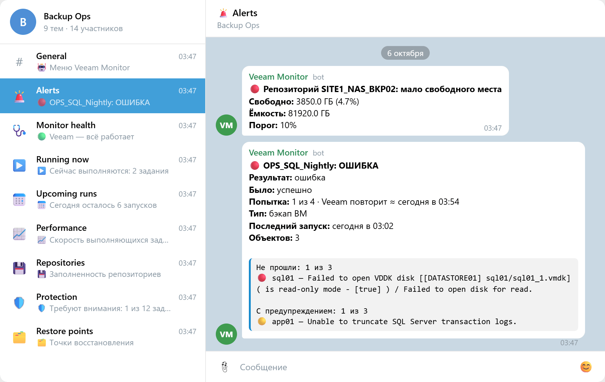
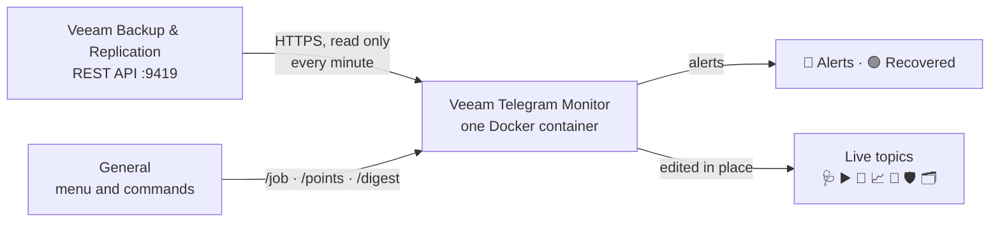
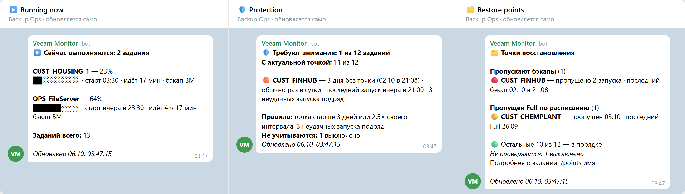
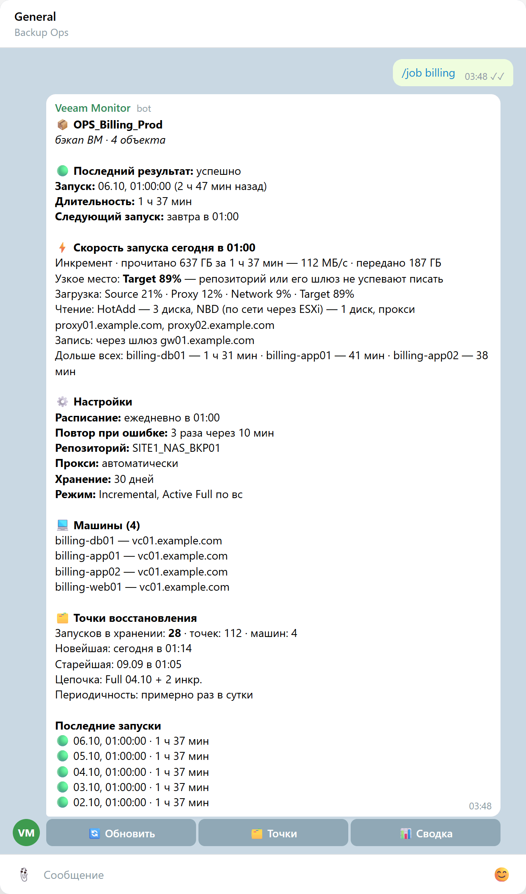
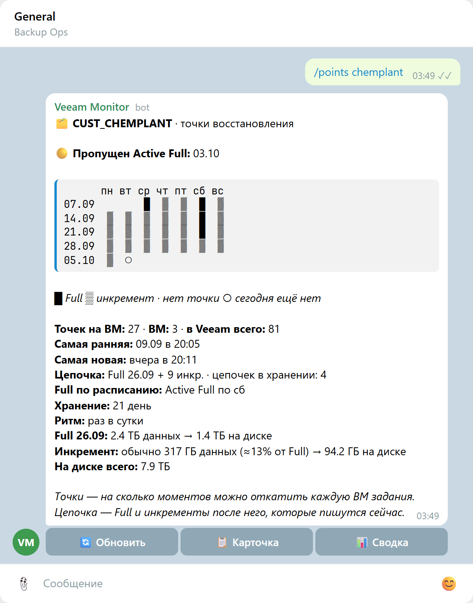
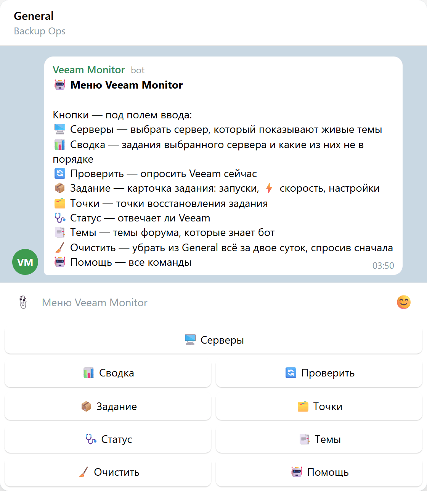

<p align="center">
  
</p>

<h1 align="center">Veeam Telegram Monitor</h1>

<p align="center"><strong>Your backups, reported to the team chat before anybody has to ask.</strong></p>

<p align="center">
  <a href="https://github.com/MuratFaizulla/veeam-monit/actions/workflows/test.yml" target="_blank"></a>
  <a href="CHANGELOG.md"></a>
  <a href="LICENSE"></a>
  
  
  
  
  
</p>

<p align="center">
  <a href="#about">About</a> ·
  <a href="#why-this-bot">Why this bot</a> ·
  <a href="#how-it-works">How it works</a> ·
  <a href="#screenshots">Screenshots</a> ·
  <a href="#getting-started">Getting started</a> ·
  <a href="#commands">Commands</a> ·
  <a href="#documentation">Documentation</a>
</p>

<p align="center">
  <picture>
    <source media="(prefers-color-scheme: dark)" srcset="docs/assets/screenshots/overview-dark.png" />
    
  </picture>
</p>

## About

Veeam Telegram Monitor is a bot for teams that run [Veeam Backup & Replication](https://www.veeam.com/). It reads Veeam's REST API and keeps a Telegram group informed: it alerts when a job fails or recovers and when a repository runs short of space, and it keeps **live topics**, messages it edits in place, that show what is running now, what is scheduled next and which jobs lack fresh restore points.

The bot is read-only: it never starts, stops or changes anything in Veeam. It needs no public address, because it pulls its updates from Telegram, and it runs as a single Docker container next to your backup server.

> [!NOTE]
> The bot speaks Russian: its messages, buttons and command help are in Russian. The code, its comments and all the documentation are in English.

## Why this bot

Veeam can already email a report per job session, and its console shows every session. What a team on call actually needs is different:

- **One message per problem, not per attempt.** By default Veeam retries a failed job three times, so one bad night looks like four failures. The bot counts them as one run, says whether Veeam will try again and when, and follows the run to its end in one more message: recovered, or failed for good.
- **"Success" is not the same as "protected".** A job can report success and still leave a machine without a fresh restore point, or skip the Full it was scheduled for. The bot judges restore points per machine, against each job's own rhythm: a nightly job two days stale has missed two backups; a weekly one has not.
- **The answer is in the chat the team already reads.** Live topics replace "can somebody open the console and check?", and `/job` answers a question about one job in seconds, including what held its last run back.
- **Several Veeam servers, one place.** Alerts come from all of them; the live topics show the one selected in the menu.

## Features

- 🚨 **Alerts** for failed, warning and recovered jobs, listing the machines that did not make it and Veeam's reason for each.
- 🔁 **Veeam's retries count as one run.** An alert says whether Veeam will try again and when, and the run is followed to its end in one more message rather than one per attempt.
- 📌 **Eight live topics**: monitor health, running jobs, upcoming runs, speed, repositories, protection, restore points, and backups left behind by deleted jobs.
- 🗂 **Restore points are judged per machine**, against each job's own rhythm and its Full schedule, not by a bare "Success".
- ⚡ **What held a run back.** A job's card shows the bottleneck Veeam reported (Source, Proxy, Network, Target), the transport mode of every disk (NBD, HotAdd…), the proxies and the repository gateway used, and the machines that took longest.
- 📅 **A job's last weeks at a glance**: a calendar of Fulls and increments, the size of a Full and of a typical increment, and what the job takes up on disk.
- ⌨️ **Commands and a menu** under the input field: digest, a job's card, its restore points, an on-demand check.
- 🖥 **Several Veeam servers in one bot**. A server outside the domain can sign in with an account of its own.
- 🔒 **Safe by default**: pinned Veeam certificates, a read-only account, an unprivileged container, and a bot that answers only its own groups.

## How it works



Every minute the bot asks each Veeam server for its jobs and repositories, and the selected server for the sessions in progress; once an hour it scans every restore point of the selected server. Alerts go to their topic once per run; the live topics are rewritten in place. What the bot must remember across restarts (last results, runs Veeam is still retrying, the IDs of its messages) is kept in one JSON file. More in [docs/architecture.md](docs/architecture.md).

## Screenshots

<sub>Rendered by the bot's own code from an invented estate: every job, machine and server name is made up.</sub>

<p align="center">
  <strong>Live topics: running now, protection, restore points</strong><br />
  <picture>
    <source media="(prefers-color-scheme: dark)" srcset="docs/assets/screenshots/live-dark.png" />
    
  </picture>
</p>

<table>
  <tr>
    <th>⚡ <code>/job</code>: a job's card and what held its last run back</th>
    <th>🗂 <code>/points</code>: the last weeks of a job, a day to a mark</th>
  </tr>
  <tr>
    <td valign="top">
      <picture>
        <source media="(prefers-color-scheme: dark)" srcset="docs/assets/screenshots/job-dark.png" />
        
      </picture>
    </td>
    <td valign="top">
      <picture>
        <source media="(prefers-color-scheme: dark)" srcset="docs/assets/screenshots/points-dark.png" />
        
      </picture>
    </td>
  </tr>
  <tr>
    <th colspan="2">⌨️ The menu under the input field</th>
  </tr>
  <tr>
    <td colspan="2" align="center">
      <picture>
        <source media="(prefers-color-scheme: dark)" srcset="docs/assets/screenshots/menu-dark.png" />
        
      </picture>
    </td>
  </tr>
</table>

## Requirements

- **Docker with Compose**, or Node.js 22+ and npm.
- Network access to the Veeam Backup & Replication REST API, usually port `9419`. REST API 1.1 and 1.2 are both supported; the bot finds out which one a server speaks.
- A dedicated, read-only Veeam account. The recommended role is **Veeam Backup Viewer**.
- A bot created with [@BotFather](https://t.me/BotFather) and a **supergroup with topics enabled (a forum)**. Make the bot an administrator with **Manage topics** so it can create the topics it needs.

## Getting started

```bash
git clone https://github.com/MuratFaizulla/veeam-monit.git
cd veeam-monit
cp .env.example .env            # Veeam servers, the read-only account, bot token, group id
docker compose up -d --build
docker compose logs -f
```

The minimum `.env`:

```dotenv
VEEAM_SERVERS=https://veeam01.example.com:9419
VEEAM_MONITOR_USERNAME=svc-veeam-monitor
VEEAM_MONITOR_PASSWORD=...
TELEGRAM_BOT_TOKEN=...
TELEGRAM_CHAT_IDS=-1001234567890
TELEGRAM_ADMIN_KEY=...        # at least 32 characters: openssl rand -hex 32
```

To learn the group's id, start the bot with `TELEGRAM_CHAT_IDS` empty and send `/chatid` in the group. Veeam ships with a self-signed certificate: pin it with `VEEAM_TLS_CERTS` rather than turning verification off. Within a minute of a successful start the live topics appear in the group and the menu in General, and `GET http://localhost:3000/api/health` says whether each Veeam server is reachable.

Rather not build? Every release is published as an image, `ghcr.io/muratfaizulla/veeam-monit`, for amd64 and arm64; set `MONITOR_IMAGE` in `.env` and see [docs/getting-started.md](docs/getting-started.md).

> [!CAUTION]
> Run **one instance** per bot token. Two instances take Telegram updates from each other (`409 Conflict`) and send every alert twice.

**A server with no internet access** (no npm registry, no Docker Hub) cannot build the image. Build it on a machine that can and ship it ready with `deploy/offline.sh user@host`; see [docs/getting-started.md](docs/getting-started.md).

## Commands

| Command | What it does |
| --- | --- |
| `/status` | Whether Veeam answers and the monitor account signs in |
| `/servers` | The Veeam servers and their state; choose the one the live topics show |
| `/digest` | Every job of the selected server, and which ones are not fine |
| `/job <name>` | One job's card: last result and reason, runs, schedule, settings, what held the last run back |
| `/points <name>` | One job's restore points: calendar, chain, missed Fulls, retention, sizes |
| `/check` | Poll Veeam now |
| `/topics` | The forum topics the bot knows |
| `/clear` | Empty General of the last two days, then put the menu back |
| `/menu`, `/help` | The menu under the input field; this list |

A name can be typed in part and in any case: `/job kingston db` finds `OPS_Veeam_DB_Kingston`. Every command is also a key of the menu.

## Documentation

- Requirements, first run, running on a server: [docs/getting-started.md](docs/getting-started.md)
- Every setting and its default: [docs/configuration.md](docs/configuration.md)
- Commands and the menu: [docs/commands.md](docs/commands.md)
- Topics, Veeam's retries and live messages: [docs/telegram.md](docs/telegram.md)
- HTTP API and Swagger: [docs/http-api.md](docs/http-api.md)
- How the code is organised, CI and releases: [docs/architecture.md](docs/architecture.md)
- Common problems and what to do: [docs/troubleshooting.md](docs/troubleshooting.md)
- The domain language the code is written in: [CONTEXT.md](CONTEXT.md)

## Development

```bash
npm ci
npm test            # builds the service and runs the tests against the compiled code
npm run start:dev
```

CI runs the tests and starts the Docker image on every push and pull request; a tag `vX.Y.Z` publishes the image and a GitHub release. How to cut one is in [docs/architecture.md](docs/architecture.md#development). What changed in each version is in [CHANGELOG.md](CHANGELOG.md).

## Get involved

- Found a bug, or missing something? [Open an issue](https://github.com/MuratFaizulla/veeam-monit/issues/new/choose); the form asks for what usually explains it. [Troubleshooting](docs/troubleshooting.md) may already have the answer.
- Pull requests are welcome: [CONTRIBUTING.md](CONTRIBUTING.md) explains how the code is laid out, how it is tested and what a change needs.
- Use only invented names and documentation addresses (`example.com`, `192.0.2.0/24`) in code, tests and issues, never those of a real installation.

## Security

The bot only reads from Veeam and only answers its own groups and their members; it leaves any other group it is added to. Veeam certificates are pinned by their SHA-256 fingerprint, so the password is only ever sent to a verified server. When Veeam refuses the password, the bot waits instead of retrying every minute, so it does not lock the account out. Keys shorter than 32 characters are refused, the container runs unprivileged on a read-only file system, and its port is published on the host's loopback only.

Please report vulnerabilities privately, not in Issues. [SECURITY.md](SECURITY.md) says how, and what to do if a secret leaks.

## Author

[Murat Faizulla](https://github.com/MuratFaizulla)

## License

Veeam Telegram Monitor is licensed under the [Apache License 2.0](LICENSE).

<sub>Veeam and Veeam Backup & Replication are trademarks of Veeam Software; this project is not affiliated with Veeam Software. Icons by <a href="https://simpleicons.org">Simple Icons</a> (CC0).</sub>
