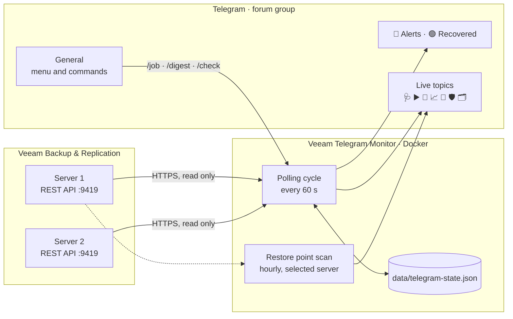

# How it works

[← README](../README.md) · [Documentation](README.md)



Polling runs at start and then on a timer. Everything the bot must remember across restarts is in `data/telegram-state.json`:

- the last results of jobs, and the runs Veeam is still retrying;
- known chats and topics;
- the IDs of the live messages;
- cooldowns.

After every write a copy, `telegram-state.json.bak`, is saved next to it, and if the main file is damaged the state is restored from the copy.

## Modules and folders

One Nest module per subject, and one folder per module. The folders sit in layers, and every import, between Nest modules and between files alike, goes only down:

```
updates   TelegramUpdatesModule   commands, buttons, webhook, HTTP endpoints
monitor   MonitorModule           polling cycle and alerts; exports only MONITOR
live      LiveModule              live topics: what they say, and one message per topic
estate    EstateModule            restore points, the job card, the digest, runs
veeam     VeeamModule             HTTP client, token, reading Veeam, repository and proxy names
telegram  TelegramModule          delivery: chats, topics, routing, the state file, the bot's language
config                            settings: one declaration per variable
```

Two folders without a module of their own sit in the layers too: `logging` (the file log) at the bottom next to `config`, and `http` (`/api/health` and the API description) at the top next to `updates`. `veeam` and `telegram` are neighbours in one layer and do not import each other.

`test/architecture.test.cjs` fails if an import points up or sideways, or if the application stops building.

## Development

```bash
npm run lint   # TypeScript type check
npm test       # build and run every test (node:test)
```

The tests are written in JavaScript and test the built service, the same code that goes into the image. They run in GitHub Actions on every push to `main` and on every pull request; Dependabot proposes library updates once a week.

The domain glossary (Run, Attempt, Evidence and the other terms of the code) is in [CONTEXT.md](../CONTEXT.md), and the architecture decisions are in [adr/](adr/).
