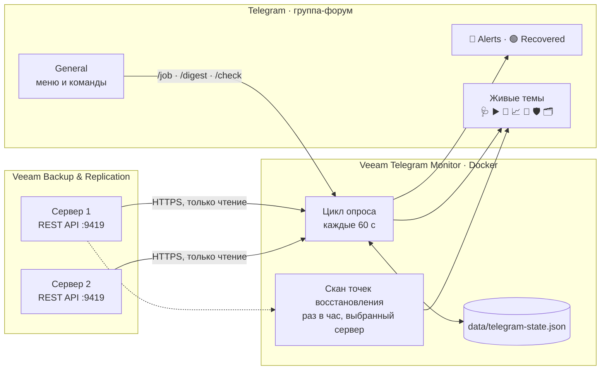

# Как это устроено

[← README](../README.md) · [Документация](README.md)



Опрос идёт при старте и дальше по таймеру. Всё, что бот должен помнить между перезапусками, лежит в `data/telegram-state.json`:

- последние результаты заданий и запуски, которые Veeam ещё повторяет;
- известные чаты и темы;
- номера живых сообщений;
- периоды ожидания.

После каждой записи рядом сохраняется копия `telegram-state.json.bak`, и если основной файл повреждён, состояние восстанавливается из неё.

## Модули и папки

Один Nest-модуль на предмет и одна папка на модуль. Папки лежат слоями, и любой импорт — и между Nest-модулями, и между файлами — идёт только вниз:

```
updates   TelegramUpdatesModule   команды, кнопки, webhook, HTTP-эндпоинты
monitor   MonitorModule           цикл опроса и оповещения; наружу отдаёт только MONITOR
live      LiveModule              живые темы: что в них написано и одно сообщение на тему
estate    EstateModule            точки восстановления, карточка задания, сводка, запуски
veeam     VeeamModule             HTTP-клиент, токен, чтение Veeam, имена репозиториев и прокси
telegram  TelegramModule          доставка: чаты, темы, маршрутизация, файл состояния, язык бота
config                            настройки: одно объявление на переменную
```

Две папки без своего модуля тоже стоят в слоях: `logging` (файловый журнал) — внизу, рядом с `config`; `http` (`/api/health` и описание API) — наверху, рядом с `updates`. `veeam` и `telegram` — соседи одного слоя и друг друга не импортируют.

`test/architecture.test.cjs` падает, если импорт укажет вверх или вбок, или если приложение перестанет собираться.

## Разработка

```bash
npm run lint   # проверка типов TypeScript
npm test       # сборка и все тесты (node:test)
```

Тесты написаны на JavaScript и проверяют собранный сервис — тот же код, что уходит в образ. Они запускаются в GitHub Actions на каждый push в `main` и на каждый pull request; Dependabot раз в неделю предлагает обновления библиотек.

Словарь предметной области — Run, Attempt, Evidence и другие термины кода — в [CONTEXT.md](../CONTEXT.md), архитектурные решения — в [adr/](adr/).
